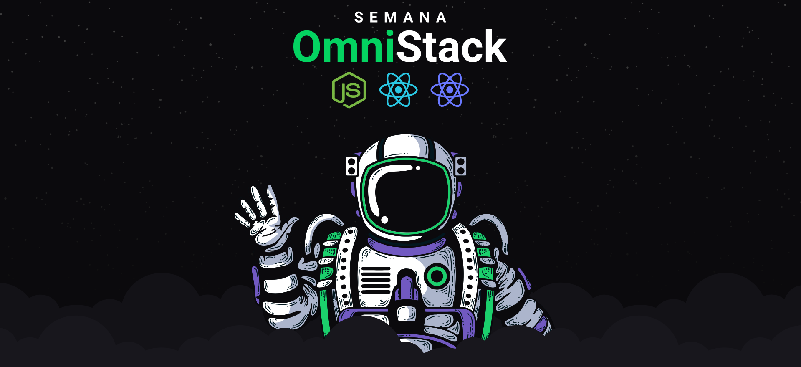

 

<h1 align="center">
  :rocket: Semana OmniStack 11.0 :rocket:
</h1>

  

  
  
  
  

---

  

## Projeto
O **Be the Hero** é um projeto que visa dar a possibilidade das pessoas ajudarem ONGs de uma forma simples e fácil.  
O desenvolvimento ocorreu durante a semana Omnistack da [Rocketseat](https://rocketseat.com.br/).
 

---
- ## :computer: Web

  

  
- ## :iphone: Mobile

  

---
## Tecnologias

Esse projeto utilizou as seguintes tecnologias:

- [Node.js](https://nodejs.org/en/)
- [Express](https://expressjs.com/pt-br/)
- [React](https://reactjs.org)
- [React Native](https://facebook.github.io/react-native/)
- [Expo](https://expo.io/)

---
## Licença

[LICENSE](LICENSE) & [Rocketseat](https://rocketseat.com.br/)

---
:squirrel:

